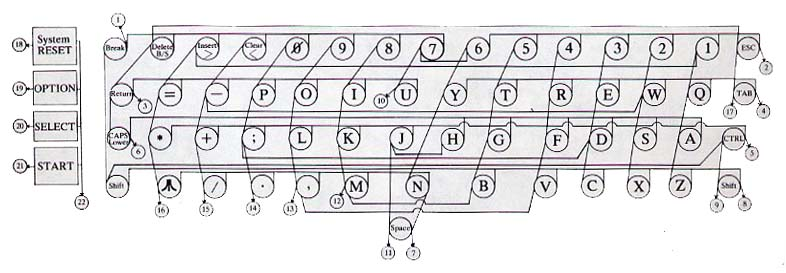
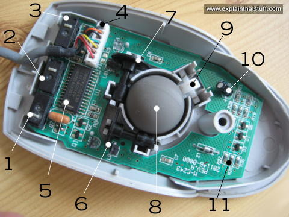
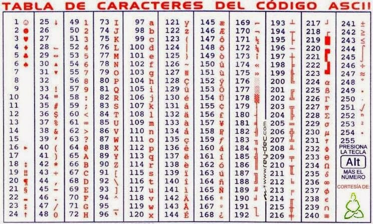
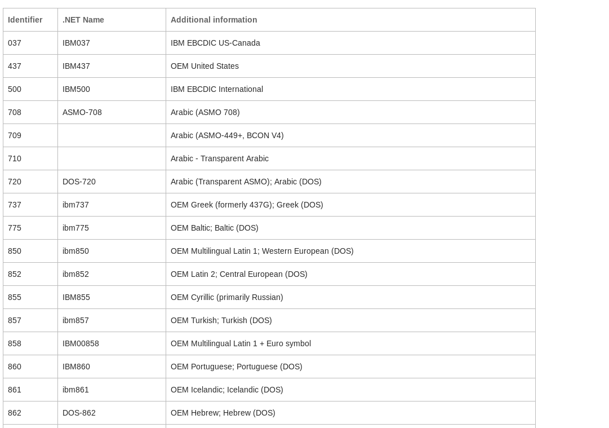
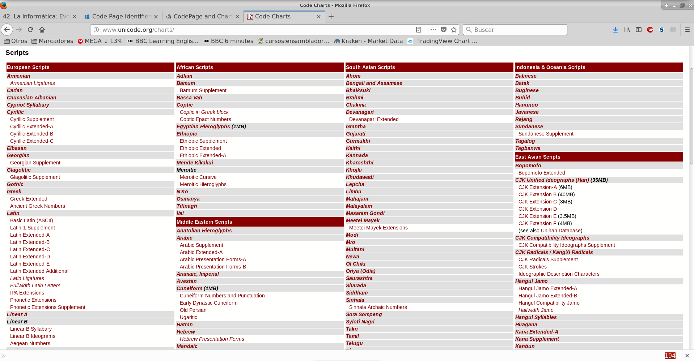

================================================================================================================================================================================================================================================
42. La informática: Evolución histórica. Funciones y fases de un proceso de datos. Proceso electrónico de datos. Representación interna de datos. Sistemas de codificación de caracteres. Archivos y registros.
================================================================================================================================================================================================================================================

Evolución histórica
=====================
Al igual que en la historia universal,no todo el mundo considera igual de importantes algunos eventos, pero en la exposición siguiente se enumeran algunos que parecen ser bastante reconocidos dentro del mundo de la informática

Siglo VIII
-------------

Se inventa en Persia el concepto de "algoritmo" (un algoritmo en el fondo es como una receta)

Siglo XVII
----------

Se inventan diversas calculadoras, que funcionan como las viejas maquinas registradoras de las tiendas: usando engranajes y girando una manivela para calcular el resultado. Cada una va incorporando funciones nuevas, las primeras solo sumaban y algunas de las últimas hasta podían dividir. Sin embargo todas ellas se rompían con facilidad y además manejaban pocas cifras (5 como máximo).

En este siglo Von Kempelen inventó un maniquí que jugaba al ajedrez. Hacía trampa ya que había un jugador dentro de una caja que manipulaba el maniquí con un sistema de poleas y engranajes, pero como el mecanismo seguía siendo muy bueno y el engaño fue muy popular se le ha dado cierto reconocimiento dentro del mundo de la informática.

Siglo XVIII
------------

Mahon inventa una "máquina lógica" que resolvia cosas como el "modus ponens" y el "modus tollens". También resolvía preguntas sencillas de probabilidad.

Siglo XIX
----------

El "ingenio analítico" o "máquina analítica" de Charles Babbage no llegó a completarse, pero se diseñó para leer datos de tarjetas perforadas, realizar cálculos trigonométricos y logarítmicos y devolver sus resultados en una impresora. Babbage murió sin completar el proyecto. Su "ayudante", Ada Lovelace, hija de Lord Byron, el poeta inglés es en general reconocida como el primer programador. Por lo avanzado del diseño, esta máquina es considerada por unanimidad el antecesor original de los ordenadores modernos.

En este siglo Stteiger perfecciona las calculadoras de engranajes y consigue crear una máquina completamente fiable y además producirla en serie. Esta máquina triunfa en las empresas y en el mundo científico de la época y fue conocida como "la millonaria" (la máquina podía manejar muchas cifras) y dando a su creador el apodo de "el millonario" (juego de palabras dado que su creador también se hizo muy rico).

Siglo XX
-----------

Primera mitad
~~~~~~~~~~~~~~~~~~~

* Se inventa el tubo de vacío, la primera válvula "controlable" o "programable", pero era mecánica,  y fallaba con facilidad.

* Torres Quevedo construye (ahora sí) un ajedrecista de verdad y crea una solución para representar los decimales en binario (se hablará más de esto despues). Ambos fueron grandes hitos en la historia de la informática, pero son poco conocidos en España.

* Se ivnenta un circuito electrónico que permite almacenar información: el flip-flop.

Década 1950-1960
~~~~~~~~~~~~~~~~~~~

Se construyen ordenadores completos y programables usando los tubos de vacío, que son considerados la I generación de ordenadores. Como los tubos de vacío y otras válvulas se rompían con facilidad eran poco fiables y no se usaron demasiado. Como ejemplo, el ENIAC fue uno de los pocos ordenadores que tuvieron uso (calculo de trayectorias de misiles). Gastaba 200.000 watios, pesaba 200 toneladas, hacia unas 5000 sumas por segundo (cualquier ordenador moderno puede hace millones), ocupaba 160 m2 de un sótano y elevaba la temperatura dentro a 50 grados. Tales temperaturas solían romper los mecanismos varias veces al día, pero aún así fue un gigantesco avance.

Poco despues se inventa una versión mejorada, electrónica y fiable del tubo de vacío llamado transistor, que permite fabricar componentes electrónicos mucho más reducidos, más fiables y más rápidos. Los ordenadores basados en transistores se conocen como la II generación donde el primer representante fue una empresa llamada IBM con su ordenador IBM-1401. IBM también crea el primer disco duro con 5 Megabytes, que costaba más de un millón de dólares de la época.

En este misma década la almirante Grace Hopper inventa el concepto de compilador: "programa que traduce algoritmos en un lenguaje parecido al inglés (lenguaje de programación) al lenguaje de instrucciones simples usados por los ordenadores". Basándose en esto se desarrolla el lenguaje Cobol (lenguaje para negocios) que permite hacer programas de gestión empresarial con facilidad.

Década 1960-1970
~~~~~~~~~~~~~~~~~~~~~
La empresa DEC (ya desaparecida) lanza el primer ordenador asequible pensado para todos los públicos, tuvo un gran éxito en las PYMES de la época. Se basó en una tecnología llamada "impresión de circuitos", que permitía fabricar productos electrónicos con rapidez al "imprimir" en lugar de ensamblar.

Se inventan los conceptos de conectar ordenadores para compartir información (ARPANET, que luego dio lugar a Internet).

Decada 1970-1980
~~~~~~~~~~~~~~~~~~~~~~~

* Intel lanza su primer microprocesador, el 4004.

* Aparece la primera consola de videojuegos con un enorme éxito.

* Se crean los protocolos TCP/IP

* Steve Jobs y su compañero lanzan el primer ordenador Apple, con un gran éxito.

* Se funda una pequeñisima empresa llamada Microsoft.

Decada 1980-1990
~~~~~~~~~~~~~~~~~~~~~

* IBM lanza un ordenador llamado PC que permite a otros fabricantes fabricar piezas de repuesto. En poco tiempo se empiezan a vender ordenadores completos fabricados solo a partir de la piezas de esos otros fabricantes (para disgusto de IBM) que eran muchos más baratos y con el sobrenombre "PC compatible".

* Se lanza algunos ordenadores para pequeños usuarios llamados Spectrum, Amstrad o Commodore que tuvieron mucho éxito en España.

* Se inventa la primera impresora láser.

* Se inventa el primer navegador. Solo tuvo exito en el mundo cientifico.

* Microsoft compra un sistema llamado QDOS y lo revende con el nombre MS-DOS (para disgusto del creador de QDOS). Poco despues lanza un producto llamado Windows 1.0 que tuvo muy poco éxito. Poco despues fabrica Microsoft Office pero solo para los ordenadores Mac.

* Se inventa Tetris.

Decada 1990-2000
~~~~~~~~~~~~~~~~~~~

* Despues de diversas mejoras se lanza Windows 3.1 que ahora sí tuvo mucho éxito.

* Se crea UNICODE (más sobre esto despues)

* Se populariza Internet por medio de las páginas Web (Internet son muchos protocolos y la Web solo es uno de ellos). Los navegadores se hacen famosos.

* Se lanza Linux.

* Se lanza Windows 95.

* Se lanzan los DVD.

Decada 2000-2010
~~~~~~~~~~~~~~~~~~~

* Se lanza Windows XP que supuso la toma definitiva del mercado por Microsoft y  Office conquista el mercado. Al hacer desaparecer a todos los competidores, poniendo a Microsoft en situación de monopolio en todos los mercados (sistemas operativos y programas), lo que daría lugar a muchas demandas en USA y la UE.

* Se lanza el iPhone que muchos analistas consideraron "irrelevante". Poco despues se lanza Android por parte de Google.

* Aparece una pequeña página para compartir videos domésticos llamada YouTube.

Decada 2010-Actualidad
~~~~~~~~~~~~~~~~~~~~~~~~~

* Surgen nuevas versiones de Windows que mantienen a Microsoft como dominadora de los sistemas operativos.

* Apple consolida su posicion aunque siempre por detras de Android en telefonía móvil. Sin embargo, todos los analistas coinciden en señalar la enorme estabilidad del mercado dominado por Apple, con clientes fieles y unos beneficios grandes a pesar de su pequeño porcentaje de mercado.

Funciones y fases de un proceso de datos
=============================================

Introducción
---------------

Reducido a su nivel más básico cualquier proceso de datos tiene tres fases: entrada de datos, procesamiento de los mismos y generación de los resultados en una salida.

   
.. blockdiag::
   :scale: 200
   
   blockdiag proceso {
    entrada         [ shape = ellipse ]
    procesamiento   [ shape = ellipse ]
    salida          [ shape = ellipse ]
    
    entrada -> procesamiento -> salida  -> entrada
   }
   
Como puede apreciarse en el esquema, es frecuente que los datos que se obtienen en la salida permitan corregir errores o hacer ajustes en datos de entrada y así refinar el proceso de datos. A continuación se analizan las distintas fases.

Entrada de datos
------------------

Para introducir datos se utilizan los llamados "periféricos", es decir, dispositivos que aún no siendo parte directa de un ordenador, son prácticamente imprescindibles su uso. En realidad hay varios que se les conoce como "periféricos de Entrada/Salida" y que pueden usarse para todo.

A continuación se indican algunos de los dispositivos de entrada más usados.

* Teclado.
* Raton.
* Micrófono.

Teclado
~~~~~~~~~

Un teclado es solamente una tabla de interruptores. Cuando se pulsa una tecla el dispositivo envía a la CPU las coordenadas (fila, columna) de la tecla pulsada y el sistema operativo muestra en pantalla el símbolo pulsado. Cabe destacar que si hay algo más configurado en el sistema operativo, podríamos ver un símbolo equivocado (algo que ocurre a veces con usuarios que necesitan indicar a Windows el "mapa de teclado" que asocia a las filas y columnas el símbolo correcto)

   
   Esquema de un teclado
   
Ratón
~~~~~~~~

Todos los ratones funcionan de la misma manera. Detectan la cantidad de movimiento en el eje de las X y de las Y y envían el incremento a la CPU, que corregirá la posición del puntero en función del movimiento. Los ratones actuales funcionan con un diodo que emite luz y un sensor que detecta la luz. Utilizando una lupa para ampliar los rayos de luz, el sensor puede detectar cuanto se ha movido un ratón en cada coordenada.

En los ratones más antiguos se usaba una bola que se movía a la vez que el ratón haciendo girar unas pequeñas ruedas que indicaban la cantidad de movimiento en X e Y.

   
   Ratón de bola (6 y 7 son los sensores de X e Y)
   

   
   Ratón óptico
   

Procesamiento de datos
--------------------------

Salida de datos
---------------------------
La CPU utiliza los dispositivos de salida de datos para entregar al usuario los resultados de un cálculo. Los más usados hoy en día son

* Monitor
* Impresora

Entrada/Salida
-------------------

Se utilizan tanto para leer datos como para entregar resultados. Los más usados son:

* Dispositivos de almacenamiento: discos duros, discos ópticos...
* Dispositivos de red: tarjetas de red, routers...

Entrada de datos
-----------------------

En esta primera fase se utilizan diversos mecanismos para introducir los datos del problema. Aunque en el pasado se han utilizado tarjetas perforadas e incluso interruptores pulsados a mano, el sistema más típico para introducir información es el teclado para información textual y el ratón para selección de opciones.

Funcionamiento del teclado
-----------------------------------
Un teclado es, en su forma más básica, una matriz de botones. Cuando se pulsa un botón, el teclado envía a la CPU el número de fila y de columna de los botones que se ha pulsado. El sistema operativo debe haberse instalado indicando el idioma correcto del teclado que usamos, ya que de no hacerlo así, se podrían ver letras incorrectas.Es decir, *el teclado no sabe en qué idioma está* . Desde el punto de vista del hardware solo detecta pulsaciones de botones, y además raramente puede detectar combinaciones de 5-6 teclas pulsadas a la vez. Esta simplificación reduce la circuitería y por tanto el coste, además de tener cierta lógica ya que pulsar 3 o más teclas a la vez es bastante complicado.

Funcionamiento del ratón
----------------------------------

Dado el enfoque histórico de este tema se comenta como funcionan los ratones mecánico  (de bola), a pesar de que han desaparecido del mercado y pocos usuarios conservan ya uno de este tipo.

Un ratón mecánico funciona con dos sensores que detectan cuanto se ha movido el ratón en las coordenadas X e Y. En la vida real se introdujo rápidamente un tercer sensor puesto en diagonal que permitía mejorar la precisión. El ratón simplemente indica a través de su conexión la cantidad de puntos que se movía en el eje X o Y y el sistema operativo mueve el puntero de manera acorde.

Los ratones ópticos funcionan con una pequeña cámara que toma imágenes continuamente y las compara para detectar el movimiento del ratón. Estos ratones tienen más precisión, funcionan en más superficies y además no se ensucian por dentro (problema muy común en los antiguos ratones mecánicos)

Conexiones de dispositivos
------------------------------------
El funcionamiento interno de estos dispositivos no cambia en función de si su conexión es alámbrica o inalámbrica. La única diferencia es que en los dispositivos con cable la información se envía en forma de impulsos eléctricos y en los inalámbricos las coordenadas de tecla o de ratón se envían por ondas electromagnéticas usando el protocolo Bluetooth.

Procesado de datos
---------------------------

Salida de datos
-----------------------------

Proceso electrónico de datos.
=============================================

En el diagrama siguiente se muestra como funciona con exactitud el procesamiento electrónico de datos. Para comprenderlo se debe tener en cuenta lo siguiente:

.. IMPORTANT::
   La tecnología de procesamiento de datos no ha avanzando tan deprisa como la tecnología de almacenamiento y es poco probable
   que se sincronicen, ya que sus objetivos no son los mismos y los costes asociados tampoco.
   
Por todo ello, todos los sistemas electrónicos de procesamiento de datos se organizan de manera similar a lo mostrado en el diagrama siguiente:

.. blockdiag::
   :scale: 200
   
   blockdiag procesoelectronico {
    orientation = portrait
    Procesador <-> "Registros\nMuy rapidos\nMuy caros" <-> "Memoria RAM\nRapida\nCara"  <-> "Memoria externa\nLenta\nBarata"
   }

* El procesador es el verdadero corazón de un ordenador. Es capaz de efectuar operaciones a velocidades muy altas, de hecho cualquier procesador relativamente moderno puede hacer **millones de sumas por segundo**.
* Los registros son un pequeño grupo de almacenes de memoria de donde el procesador toma los datos para hacer cálculos. Un registro solo puede almacenar un dato. Deberían ser tan rápidos como el procesador, pero fabricar memoria tan rápida es muy caro. Debido a esto, los ordenadores modernos tienen como mucho 128 registros.
* La memoria RAM es razonablemente rápida, pero mucho menos que el procesador. A cambio es mucho más grande y a día de hoy cualquier ordenador doméstico puede almacenar en RAM miles de millones de datos. Los datos en RAM se borran al apagar el ordenador.
* La memoria externa (normalmente discos duros) es mucho mayor que la RAM y no se borra aunque el ordenador se apague. En comparación con el procesador es muchísimo más lenta, aunque cargar un archivo de disco nos parezca rápido.

En la tabla siguiente se resumen las características de los elementos de un ordenador

+--------------+--------------+------------+-------------+
| Elemento     |  Rapidez     | Precio     | Volatilidad |
+==============+==============+============+=============+
| Procesador   | El que más   | El que más | Total       |
+--------------+--------------+------------+-------------+
|  Registros   | Muy rápidos  | Muy alto   | Total       |
+--------------+--------------+------------+-------------+
|   RAM        | Rápida       |  Alto      | Total       |
+--------------+--------------+------------+-------------+
| Externa      | Media        | Medio      | Muy baja    |
+--------------+--------------+------------+-------------+

Todo proceso electrónico de datos trabaja siempre con datos en los registros. Sin embargo, los datos pueden estar en distintas zonas del ordenador en función de las necesidades. Analicemos un ejemplo en el que un usuario desea hacer algunas operaciones con datos almacenados en una hoja de cálculo.

1. Inicialmente los datos están en el disco duro.
2. Cuando el usuario abre el fichero, el sistema operativo carga los datos en RAM.
3. Si el usuario introduce un cálculo el sistema operativo mueve los datos a los registros.
4. Con los datos en registros se hace el cálculo.
5. Los resultados se devuelven a RAM para dejar los registros libres.
6. Si el usuario desea guardar el archivo los datos de RAM se vuelcan a disco para futuros procesamientos.

Este tránsito de datos se da continuamente y sin que el usuario se dé cuenta. De esta manera, se reduce el coste de los ordenadores y la velocidad media es bastante alta. 

Representación interna de datos.
=============================================

Los ordenadores utilizan impulsos eléctricos para procesar datos. Por costumbre suele asumirse que

* Si hay un impulso eléctrico se representa con un 1.
* Si no hay impulso se utiliza un 0.

A estos valores se les llama "bit" (de Binary digIT). Basándose en bits, los ordenadores procesan y almacenan usando la base 2 (o binario) para todo. Por comodidad estos bits suelen agruparse en bloques de 8, a los que se denomina bytes. Se usa 8 porque es la potencia de 2 más cercana a 10 (que es el que usamos las personas). Evidentemente es necesario entonces codificar cualquier dato en binario, sin embargo se usan distintos sistemas: hay sistemas para números y sistemas para letras (caracteres) y aún así, hay subsistemas para números enteros frente a subsistemas para números con decimales.

.. blockdiag::
   :scale: 200
   
   blockdiag subsistemasrepresentacion{
    orientation = portrait
    "Representación" -> "Números"
    "Números" -> "Sin decimales"
    "Números" -> "Con decimales"
    "Representación" -> "Texto" [folded]
   }
   
Números sin decimales
----------------------------

Hay muchos procedimientos para convertir un número a binario. Una posibilidad es tomar un número, dividirlo por 2 hasta que sea imposible seguir y luego *se toma el último cociente y todos los restos de final a principio*. Así, por ejemplo, para convertir el 241 podemos hacer esto

+----------+-------------+--------+
| Número   |  Cociente   | Resto  |
+==========+=============+========+
| 241 : 2  |    120      |   1    |
+----------+-------------+--------+
| 120 : 2  |    60       |   0    |
+----------+-------------+--------+
|  60 : 2  |   30        |   0    |
+----------+-------------+--------+
|  30 : 2  |    15       |   0    |
+----------+-------------+--------+
|  15 : 2  |    7        |   1    |
+----------+-------------+--------+
|  7 : 2   |   3         |   1    |
+----------+-------------+--------+
|  3 : 2   |   1         |   1    |
+----------+-------------+--------+
| 1 : 2    | 0           | 1      |
+----------+-------------+--------+
| 0 : 2    | No se sigue | No hay |
+----------+-------------+--------+

Así el número 241 en binario es 1111.0001 (a veces ponen puntos para separar bloques de 4 y facilitar la lectura).

A la inversa, si queremos convertir un binario en un decimal se usan las potencias de 8

+---+---+---+---+---+---+---+---+------------+
| 7 | 6 | 5 | 4 | 3 | 2 | 1 | 0 | Exponentes |
+---+---+---+---+---+---+---+---+------------+
|128| 64| 32| 16| 8 | 4 | 2 | 1 | Pot. de 2  |
+---+---+---+---+---+---+---+---+------------+
| 1 | 1 | 1 | 1 | 0 | 0 | 0 | 1 | Binario    |
+---+---+---+---+---+---+---+---+------------+

Si ahora multiplicamos los digitos binarios por las potencias y sumamos los resultados tenemos que sumar

* 128 por 1
* más 64 por 1
* más 32 por 1
* más 16 por 1
* más 1 por 1

Es decir, hay que sumar 128 + 64 + 32 + 16 + 1 que efectivamente es 241

Sistemas de codificación de caracteres.
=============================================

ASCII
----------

Significa American Standard Code for Information Interchange, "Código Standard Americano para el intercambio de información.". Fue el primer estándar para la codificación de caracteres pero por desgracia solo se pensó en la codificación de caracteres del mundo anglosajón. Usaba un solo byte (que permite codificar 2 a la 8 = 256 posibles caracteres).

.. IMPORTANT::
   Con ASCII nunca se pudo escribir nada que no fuese en inglés.

Se puede ver en la figura siguiente:

   
   Tabla ASCII

ANSI
-----
Para superar las limitaciones del inglés, surgió un estándar posterior que intentaba codificar muchos idiomas, por lo que en realidad no se puede hablar del "ANSI" sino de "tablas ANSI", por ejemplo existe la "tabla ANSI para el español" o la "tabla ANSI para el francés". Cada tabla tiene un número de estándar pero ANSI no pensó en todos los distintos idiomas que hay hoy en día. ANSI también usaba un solo byte.

   
   Algunos idiomas disponibles en tablas ANSI

.. IMPORTANT::
   ANSI fue una mejora sustancial, pero la informática ya se había empezado a extender por todo el mundo y aún había
   muchos países que no disponían de un estándar para codificar sus idiomas.

Unicode
------------

Para resolver los problemas de codificación de una vez por todas y para todo el mundo se formó el consorcio UNICODE. Éste produce tablas que estandarizan todos los idiomas de la tierra e incluso algunos antiguos. Para codificar tantas posibilidades es necesario usar a veces hasta 4 bytes. Esta ampliación, que es su gran ventaja también es un inconveniente, ya que por desgracia,  existen muchos programas informáticos que asumen que los caracteres usan un solo byte y por tanto no pueden procesar ficheros almacenados usando UNICODE.

   
   Algunos idiomas que se pueden codificar en UNICODE.
   
Resumen
----------

La tabla siguiente resume las principales características de los estándares de codificación.

+------------+-------------------+--------------+
| Estándar   |Soporta multiidioma| Tam. caracter|
+============+===================+==============+
|  ASCII     |     No            |   1 byte     |
+------------+-------------------+--------------+
|  ANSI      |   Parcial         |   1 byte     |
+------------+-------------------+--------------+
| Unicode    |    Sí             | 1-4 bytes    |
+------------+-------------------+--------------+

Archivos y registros.
=============================================

Ejemplo de archivo con registros.
