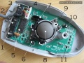
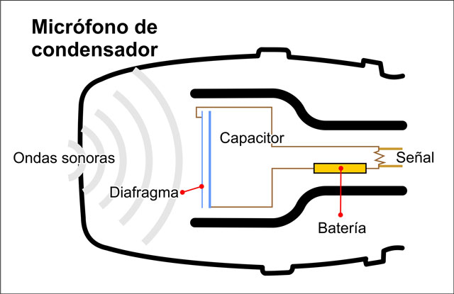
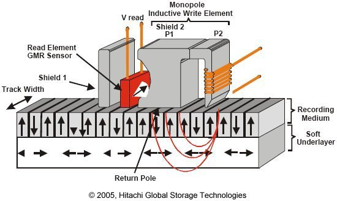
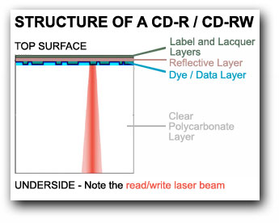
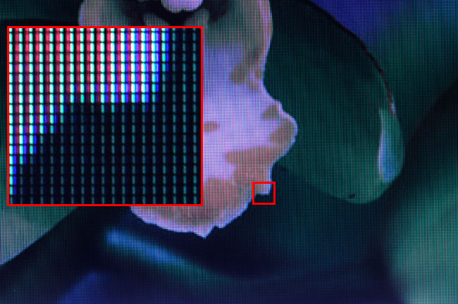

========================================================================================================
Tema 43. Sistemas informáticos: Estructura y funciones. Elementos de hardware. Elementos de software
========================================================================================================

Estructura de un sistema informático
==========================================

Fuente de alimentación
-------------------------

Placa base
---------------

Microprocesador
------------------

Memoria
------------------

Ranuras de expansión
---------------------

Tarjeta gráfica
--------------------

Funciones de un sistema informático
===========================================

Los sistemas informáticos básicamente lo único que hacen es procesar datos, pero a una velocidad muy superior a la de las personas y con una tasa de error de casi el 0%.

Procesamiento de datos
--------------------------

Definiciones
~~~~~~~~~~~~~~~

Para comprender como funciona el procesamiento de datos vamos a apoyarnos en algunas definiciones.

* Algoritmo: secuencia de pasos perfectamente descrita y que permite resolver un problema. Un algoritmo no tiene por qué aplicarse solo a la informática, de hecho una receta de cocina puede considerarse un algoritmo.
* Programa: plasmado de un algoritmo en algún lenguaje de programación.

Así, por ejemplo, el algoritmo para multiplicar 42 por 16 sería algo así como:

Paso 1
#############

*Tomar el número de más a la derecha del segundo y multiplicarlo por el de más a la derecha del primero. Si no queda arriba nada por multiplicar entonces escribir el resultado y si no escribir debajo solo el último número del resultado*

+-------+-------+-------+-------+-------+
|       |       |       |  4    | **2** |
+-------+-------+-------+-------+-------+
|       |       |       |  1    | **6** |
+-------+-------+-------+-------+-------+
|       |       |       |       | **2** |
+-------+-------+-------+-------+-------+
|       |       |       |       |       |
+-------+-------+-------+-------+-------+
|       |       |       |       |       |
+-------+-------+-------+-------+-------+

Paso 2
#############

*Multiplicar el último número de abajo por el siguiente de arriba y sumar lo que nos tocaba llevarnos de la multiplicación anterior.
Si no queda arriba nada por multiplicar entonces escribir el resultado y si no escribir debajo solo el último número del resultado*

+-------+-------+-------+-------+-------+
|       |       |       |**4**  | 2     |
+-------+-------+-------+-------+-------+
|       |       |       |  1    | **6** |
+-------+-------+-------+-------+-------+
|       |       | **2** | **5** | 2     |
+-------+-------+-------+-------+-------+
|       |       |       |       |       |
+-------+-------+-------+-------+-------+
|       |       |       |       |       |
+-------+-------+-------+-------+-------+

Paso 3
#############

*Si quedan números abajo repetir los pasos 1 y 2 escribiendo los resultados desplazados una posición hacia la izquierda*

+-------+-------+-------+-------+-------+
|       |       |       |4      | 2     |
+-------+-------+-------+-------+-------+
|       |       |       |**1**  |   6   |
+-------+-------+-------+-------+-------+
|       |       |   2   |   5   | 2     |
+-------+-------+-------+-------+-------+
|       |       |   4   |   2   |       |
+-------+-------+-------+-------+-------+
|       |       |       |       |       |
+-------+-------+-------+-------+-------+

Paso 4
#############

*Cuando no queden números que multiplicar sumar los resultados parciales*

+-------+-------+-------+-------+-------+
|       |       |       |4      | 2     |
+-------+-------+-------+-------+-------+
|       |       |       |**1**  |   6   |
+-------+-------+-------+-------+-------+
|       |       |   2   |   5   | 2     |
+-------+-------+-------+-------+-------+
|       |       |   4   |   2   |       |
+-------+-------+-------+-------+-------+
|       |       | **6** | **7** | **2** |
+-------+-------+-------+-------+-------+

Ejecución de programas
~~~~~~~~~~~~~~~~~~~~~~~~~
La ejecución de programas tiene lugar dentro del **microprocesador**. Un microprocesador toma las instrucciones de un programa (que recordemos que en el fondo es un algoritmo) y las va ejecutando una por una. Dentro de un microprocesador hay en realidad muchas partes que tienen que funcionar de forma sincronizada por lo que todo microprocesador funciona con un reloj que va marcando los pasos. La cantidad de pasos que un microprocesador puede dar por segundo se mide en Hercios o Hz, de ahí el famoso concepto  "velocidad de un procesador en Mhz" (hoy ya Ghz).

Cabe destacar que en realidad no todas las operaciones tardan exactamente un paso de reloj, sino que algunas mas lenta pueden tomar varios, sin embargo, como medida de velocidad es bastante sencilla de entender para el gran público.

Sin embargo, como acelerar los componentes se ha vuelto demasido difícil, los ordenadores modernos han empezado a "juntar varios procesadores en uno" para intentar ir más deprisa. La idea es que si tenemos dos procesadores de 2 GHz en teoría "es como si tuviéramos uno de 4 GHz", aunque sincronizar ambos procesadores no es tan fácil y suele haber una ralentización adicional. Sin embargo, como progreso es muy significativo.

En suma, un microprocesador simplemente toma datos, toma instrucciones, ejecuta las mismas con los datos suministrados y devuelve resultados. Sin embargo, su enorme velocidad y otras ventajas asociadas a los sistemas informáticos han hecho que el procesamiento electrónico de datos se haya extendido a casi todos los campos.

Elementos de hardware
============================================

El hardware puede ser de entrada o de salida, aunque algunos dispositivos muy concretos se califican como "de entrada/salida"

Hardware de entrada
----------------------

A continuación se indican algunos de los dispositivos de entrada más usados.

* Teclado.
* Raton.
* Micrófono.

Teclado
~~~~~~~~~

Un teclado es, en su forma más básica, una matriz de botones. Cuando se pulsa un botón, el teclado envía a la CPU el número de fila y de columna de los botones que se ha pulsado. El sistema operativo debe haberse instalado indicando el idioma correcto del teclado que usamos, ya que de no hacerlo así, se podrían ver letras incorrectas.Es decir, *el teclado no sabe en qué idioma está* . Desde el punto de vista del hardware solo detecta pulsaciones de botones, y además raramente puede detectar combinaciones de 5-6 teclas pulsadas a la vez. Esta simplificación reduce la circuitería y por tanto el coste, además de tener cierta lógica ya que pulsar 3 o más teclas a la vez es bastante complicado.

Un teclado es solamente una tabla de interruptores. Cuando se pulsa una tecla el dispositivo envía a la CPU las coordenadas (fila, columna) de la tecla pulsada y el sistema operativo muestra en pantalla el símbolo pulsado. Cabe destacar que si hay algo más configurado en el sistema operativo, podríamos ver un símbolo equivocado (algo que ocurre a veces con usuarios que necesitan indicar a Windows el "mapa de teclado" que asocia a las filas y columnas el símbolo correcto)

.. figure:: dibujos/esquema_teclado.jpg
   :align: center
   
   Esquema de un teclado
   
Ratón
~~~~~~~~

Dado el enfoque histórico de este tema se comenta como funcionan los ratones mecánico  (de bola), a pesar de que han desaparecido del mercado y pocos usuarios conservan ya uno de este tipo.

Todos los ratones funcionan de la misma manera. Detectan la cantidad de movimiento en el eje de las X y de las Y y envían el incremento a la CPU, que corregirá la posición del puntero en función del movimiento. Los ratones actuales funcionan con un diodo que emite luz y un sensor que detecta la luz. Utilizando una lupa para ampliar los rayos de luz, el sensor puede detectar cuanto se ha movido un ratón en cada coordenada.

En los ratones más antiguos se usaba una bola que se movía a la vez que el ratón haciendo girar unas pequeñas ruedas que indicaban la cantidad de movimiento en X e Y.

   
   Ratón de bola (6 y 7 son los sensores de X e Y)
   

   
   Ratón óptico

El funcionamiento interno de los ratones no cambia en función de si su conexión es alámbrica o inalámbrica. La única diferencia es que en los dispositivos con cable la información se envía en forma de impulsos eléctricos y en los inalámbricos las coordenadas de tecla o de ratón se envían por ondas electromagnéticas usando  Bluetooth (que usa ondas de radio de cierta frecuencia).

Micrófono
~~~~~~~~~~~~~
Aunque no un dispositivo de entrada que se use de manera habitual en la gestión administrativa, no deja de ser un periférico de utilidad para la creación de elementos multimedia. Su funcionamiento puede entenderse fácilmente con el siguiente esquema

   
   Esquema de un micrófono
   
Un micrófono convierte las ondas sonoras en bits con un mecanismo similar al del oído humano: usando dos placas metálicas muy finas y con una separación muy pequeña. Cuando las ondas sonoras entran, golpean la placa frontal que toca otra placa metálica. Esta placa metálica cierra un circuito que permite a la electricidad circular y crear así un pequeño impulso eléctrico. 

Entrada/Salida
-------------------

Se utilizan tanto para leer datos como para entregar resultados. Los más usados son:

* Dispositivos de almacenamiento: discos duros, discos ópticos...
* Dispositivos de red: tarjetas de red, routers...

Discos duros
~~~~~~~~~~~~~

Un disco duro utiliza el magnetismo para almacenar bits. En un disco duro hay pequeños imanes que se pueden girar para hacer que almacenen datos o leer usando un imán. El siguiente diagrama muestra un ejemplo:

   
   Esquema de un disco duro.
   
   
Cuando deseamos leer bits, acercamos el imán.

* Si acercamos el imán y es repelido, el imán (que va conectado a una palanca) cierra un circuito y entonces tenemos un impulso eléctrico, es decir un 1.
* Si acercamos el imán y es atraído, el imán no cierra el circuito y por tanto tenemos un 0

Discos ópticos
~~~~~~~~~~~~~~~

En un disco óptico podemos grabar un 1 o un 0 enfocando un láser que hace (o no) un pequeño agujero en el disco. Si luego usamos otro láser (menos enfocado) a esos surcos pueden pasar dos cosas:

* Si nos topamos con un hueco, el láser se refleja con un ángulo en particular y alcanzará una lente lectora que al detecta la luz asume que hay un hueco y por tanto se genera un 1.
* Si no hay hueco, el láser se refleja en un ángulo distinto y no toca la lente, por lo tanto no habrá un 1, sino un 0.

Las diferencias entre CD, DVD y Blu-Ray está en la cantidad de agujeros que las tecnologías pueden meter en cada disco. A mayor densidad de agujeros, mayor capacidad, pero  también se necesitan tecnologías más complejas para leer huecos tan pequeños.

   
   Esquema de un CD
   

Tarjetas de red
~~~~~~~~~~~~~~~~~

Las tarjetas de red son dispositivos para comunicar ordenadores **con otros equipos situados geográficamente cerca**. Normalmente, en la misma sala o como mucho en el mismo edificio. Las mas usadas hoy son las de tipo Ethernet, que obligan a conectar todos los ordenadores a un dispositivo de comunicación llamado "switch". Como no todos los ordenadores pueden usar el switch a la vez, las tarjetas de red se ocupan de "repartir el acceso".

Routers
~~~~~~~~~~~~~~~~~

Los router están pensados para conectar con ordenadores **que están lejos** y por ello se encargan de una tarea que se describe en pocas palabras: *un router decide si un bloque de datos que quiere entrar puede entrar o no y decide si un bloque de datos debe salir o no*.

Resulta que:

* Un bloque de datos que quiera entrar podría ser de un atacante o podría ser la respuesta a una petición que hemos hecho (quizá una página web que hayamos solicitado)

* Un bloque de datos quizá necesite salir y encontrar el camino para llegar a un cierto equipo. Los router colaboran entre ellos para entregándose paquetes para conseguir que todos lleguen al destino correcto.

Salida de datos
-----------------------------

Los dispositivos más comunes para la salida de datos son los monitores y las impresoras.

Monitores
~~~~~~~~~~~~

Todos ellos están formados por pequeños puntos de luz llamados píxeles (que viene de PICture Cell o célula de imagen). Iluminando los puntos con distintos colores se pueden formar imágenes como muestra la figura siguiente:

   
   Esquema de un monitor
   
Un parámetro muy importante en los monitores es la cantidad de puntos que hay. Cuantos más puntos hay en su superficie, más pequeños son y por lo tanto más difíciles son de apreciar, lo que transmite la sensación de que la imagen se ve mejor, se dice que "tiene más definición". Esta cantidad de puntos se indica con números como "1280x1024" que significa que hay 1280 puntos contando en horizontal y 1024 en vertical, es decir, más de un millón de píxeles. Ya hay monitores (y TV) que se autodenominan "4K" y que ofrecen una resolucion (y por tanto una calidad) de unos 4000 puntos en horizontal.

Impresoras
~~~~~~~~~~~~

A día de hoy las más comúnes son de dos tipos: de chorro de tinta y láser.

* Las de chorro de tinta depositan pequeñas gotas de tinta sobre el papel. Para ello van desplazando un cartucho por encima de un papel haciendo un trazado "por líneas".
* Las láser dibujan una página entera sobre un rodillo usando primero "electrones" a modo de tinta. Luego el papel se pasa por el rodillo y los electrones se transfieren. Por último el papel se pasa cerca de una tinta y los electrones del papel "atraen la tinta al papel". Este proceso es muchísimo más rápido, pero también mas costoso, por lo que el precio de estas impresoras suele ser mayor.

En realidad el análisis de costes de las impresoras es bastante más complejo y movimientos del mercado han hecho que los precios de venta de impresoras y tintas estén bastante distorsionados.

Elementos de software
=============================================

Sistemas operativos
---------------------

Windows
~~~~~~~~~~~~

Linux
~~~~~~~~~~~~~

Programas de utilidad
-----------------------

Procesadores de textos
~~~~~~~~~~~~~~~~~~~~~~~~

Hojas de cálculo
~~~~~~~~~~~~~~~~~~~~~~~

Bases de datos
~~~~~~~~~~~~~~~~~~~~~~~

Otros
~~~~~~~~~~~~~~~~~~~~~~

