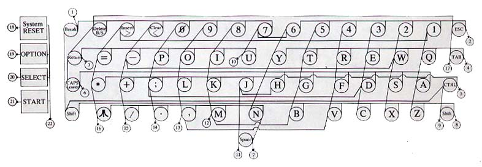

========================================================================================================
Tema 43. Sistemas informáticos: Estructura y funciones. Elementos de hardware. Elementos de software
========================================================================================================

Estructura de un sistema informático
==========================================

En líneas generales los sistemas informáticos modernos comparten una estructura común que solo varía en rendimiento y a veces en estética. Todo ordenador suele contar con los siguientes componentes:

* Fuente de alimentación.
* Placa base.
* Microprocesador.
* Memoria
* Ranuras de expansión (llamadas también zocalos o "slots")
* Tarjeta gráfica.

Fuente de alimentación
-------------------------

La fuente de alimentación cumple dos funciones igual de importantes:

* Transformador: convierte el voltaje de entrada de 220V en potencias más bajas. Si no se entiende el concepto de tensión es útil pensar en tuberías de agua: aunque las tuberías que suministran un barrio pueden tener un radio de 1m, las tuberías de un hogar cualquiera no necesitan tanta agua y suelen tener un radio de un par de centímetros. Además, como los componentes electrónicos no necesitan tanta potencia indirectamente suponen un ahorro de energia (un ordenador cualquiera gasta en torno 150W, mientras que una estufa o un secador suelen gastar 5 o 6 veces más.
* La otra función es proporcionar energía a los componentes electrónicos de la tabla y además de manera estable. La energía eléctrica no siempre entrega exactamente la misma potencia y las subidas y bajadas podrían afectar a los componentes electrónicos. Una fuente de alimentación suele tener componentes que estabilizan la energía.

.. IMPORTANT::
   Una fuente de alimentación cualquiera está diseñada para entregar como máximo X watios de energía. Si conectamos muchos dispositivos    (discos duros, etc...) es muy posible que la fuente se sobrecaliente. 

Placa base
---------------

La placa base es un tablero con componentes de interconexión en el cual se montan todos los componentes de un sistema informático. Debido a que deben coordinar todos los demás elementos se han ido volviendo muy complejos con el tiempo y se han vuelto una parte tan importante como el procesador. De hecho, para intentar manejar esa complejidad, los diseñadores las han dividido en dos partes, cada una de las cuales se ocupa de manejar distintos componentes. A estas partes se les ha llamado "puentes" y los nombres asignados han sido "puente norte" (para procesador y memoria) y "puente sur" (para discos y periféricos)

   
   Diagrama de bloques de una placa base

Microprocesador
------------------
En su definición más básica un microprocesador es un componente electrónico que ejecuta instrucciones. Sin embargo para comprender mejor su funcionamiento es necesario utilizar otras definiciones:

* Algoritmo: secuencia de pasos perfectamente descrita y que permite resolver un problema. Un algoritmo no tiene por qué aplicarse solo a la informática, de hecho una receta de cocina puede considerarse un algoritmo.
* Programa: plasmado de un algoritmo en algún lenguaje de programación.

Así, por ejemplo, el algoritmo para multiplicar 42 por 16 sería algo así como:

Paso 1
#############

*Tomar el número de más a la derecha del segundo y multiplicarlo por el de más a la derecha del primero. Si no queda arriba nada por multiplicar entonces escribir el resultado y si no escribir debajo solo el último número del resultado*

+-------+-------+-------+-------+-------+
|       |       |       |  4    | **2** |
+-------+-------+-------+-------+-------+
|       |       |       |  1    | **6** |
+-------+-------+-------+-------+-------+
|       |       |       |       | **2** |
+-------+-------+-------+-------+-------+
|       |       |       |       |       |
+-------+-------+-------+-------+-------+
|       |       |       |       |       |
+-------+-------+-------+-------+-------+

Paso 2
#############

*Multiplicar el último número de abajo por el siguiente de arriba y sumar lo que nos tocaba llevarnos de la multiplicación anterior.
Si no queda arriba nada por multiplicar entonces escribir el resultado y si no escribir debajo solo el último número del resultado*

+-------+-------+-------+-------+-------+
|       |       |       |**4**  | 2     |
+-------+-------+-------+-------+-------+
|       |       |       |  1    | **6** |
+-------+-------+-------+-------+-------+
|       |       | **2** | **5** | 2     |
+-------+-------+-------+-------+-------+
|       |       |       |       |       |
+-------+-------+-------+-------+-------+
|       |       |       |       |       |
+-------+-------+-------+-------+-------+

Paso 3
#############

*Si quedan números abajo repetir los pasos 1 y 2 escribiendo los resultados desplazados una posición hacia la izquierda*

+-------+-------+-------+-------+-------+
|       |       |       |4      | 2     |
+-------+-------+-------+-------+-------+
|       |       |       |**1**  |   6   |
+-------+-------+-------+-------+-------+
|       |       |   2   |   5   | 2     |
+-------+-------+-------+-------+-------+
|       |       |   4   |   2   |       |
+-------+-------+-------+-------+-------+
|       |       |       |       |       |
+-------+-------+-------+-------+-------+

Paso 4
#############

*Cuando no queden números que multiplicar sumar los resultados parciales*

+-------+-------+-------+-------+-------+
|       |       |       |4      | 2     |
+-------+-------+-------+-------+-------+
|       |       |       |**1**  |   6   |
+-------+-------+-------+-------+-------+
|       |       |   2   |   5   | 2     |
+-------+-------+-------+-------+-------+
|       |       |   4   |   2   |       |
+-------+-------+-------+-------+-------+
|       |       | **6** | **7** | **2** |
+-------+-------+-------+-------+-------+

Ejecución de programas
~~~~~~~~~~~~~~~~~~~~~~~~~
Un microprocesador toma las instrucciones de un programa (que recordemos que en el fondo es un algoritmo) y las va ejecutando una por una. Dentro de un microprocesador hay en realidad muchas partes que tienen que funcionar de forma sincronizada por lo que todo microprocesador funciona con un reloj que va marcando los pasos. La cantidad de pasos que un microprocesador puede dar por segundo se mide en Hercios o Hz, de ahí el famoso concepto  "velocidad de un procesador en Mhz" (hoy ya Ghz).

Cabe destacar que en realidad no todas las operaciones tardan exactamente un paso de reloj, sino que algunas mas lenta pueden tomar varios, sin embargo, como medida de velocidad es bastante sencilla de entender para el gran público.

Sin embargo, como acelerar los componentes se ha vuelto demasido difícil, los ordenadores modernos han empezado a "juntar varios procesadores en uno" para intentar ir más deprisa. La idea es que si tenemos dos procesadores de 2 GHz en teoría "es como si tuviéramos uno de 4 GHz", aunque sincronizar ambos procesadores no es tan fácil y suele haber una ralentización adicional. Sin embargo, como progreso es muy significativo.

En suma, un microprocesador simplemente toma datos, toma instrucciones, ejecuta las mismas con los datos suministrados y devuelve resultados. Sin embargo, su enorme velocidad y otras ventajas asociadas a los sistemas informáticos han hecho que el procesamiento electrónico de datos se haya extendido a casi todos los campos.

Se hablará del funcionamiento del microprocesador en el epígrafe siguiente. En cuanto a su papel en la estructura de un sistema informático se puede decir que es el corazón y el cerebro de cualquier ordenador moderno.

Los microprocesadores son lo bastante complejos para tener su propia estructura. Entre otros componentes tienen:

* Unidad aritmético-lógica: que se encarga de operaciones matemáticas.
* Unidad de control: descodifica las instrucciones que entran y prepara lo necesario para que se puedan ejecutar.
* Son pequeños bloques de memoria integrados en el microprocesador.

   Diagrama de bloques de un procesador

Memoria
------------------

<<<<<<< HEAD
Tradicionalmente se ha dividido en RAM y ROM aunque la división es un poco anárquica:

* Se llama memoria RAM o de acceso aleatorio (Random Access Memory) a la memoria en la que hay poner los datos para que sean procesados. Se puede leer y escribir en ella pero los datos se pierden cuando se apaga el ordenador.
* Se llama memoria ROM o de solo lectura (Read Only Memory) a una pequeña memoria que contiene el programa que arranca el ordenador, hace algunas comprobaciones básicas y transfiere el control al sistema operativo. Con es un sistema muy básico a veces se llama ROM-BIOS o simplemente BIOS (Basic Input/Output System o Sistema básico de entrada/salida). **En la ROM-BIOS no se puede escribir**

La memoria RAM se llamó de acceso aleatorio porque podemos ir a cualquier posición de memoria para leer o escribir un datos. Se le dió este nombre porque las memorias tradicionales estaban basadas en una cinta magnética y para recuperar ciertos datos había que rebobinar o avanzar la cinta (se decía que eran de acceso "secuencial")

La siguiente tabla resume las características de la memoria

+---------------------+-------------+--------------+
|  Tipo de memoria    |      RAM    |      ROM     |
+=====================+=============+==============+
| ¿Acceso aleatorio?  |   SÍ        |     SÍ       |
+---------------------+-------------+--------------+
| ¿Escribible?        |   SÍ        |     NO       |
+---------------------+-------------+--------------+
| ¿Pierde los datos?  |   SÍ        |     NO       |
+---------------------+-------------+--------------+
=======
La memoria almacena los programas y el microprocesador toma de ella las instrucciones que debe ejecutar y los datos que debe procesar.

.. IMPORTANT::
   La tecnología de procesamiento de datos no ha avanzando tan deprisa como la tecnología de almacenamiento y es poco probable
   que se sincronicen, ya que sus objetivos no son los mismos y los costes asociados tampoco.
   
Por todo ello, los ordenadores suelen organizar su memoria de la manera siguiente:

.. blockdiag::
   :scale: 200
   
   blockdiag procesoelectronico {
    orientation = portrait
    Procesador <-> "Registros\nMuy rapidos\nMuy caros" <-> "Memoria RAM\nRapida\nCara"  <-> "Memoria externa\nLenta\nBarata"
   }

* El procesador es el verdadero corazón de un ordenador. Es capaz de efectuar operaciones a velocidades muy altas, de hecho cualquier procesador relativamente moderno puede hacer **millones de sumas por segundo**.
* Los registros son un pequeño grupo de almacenes de memoria de donde el procesador toma los datos para hacer cálculos. Un registro solo puede almacenar un dato. Deberían ser tan rápidos como el procesador, pero fabricar memoria tan rápida es muy caro. Debido a esto, los ordenadores modernos tienen como mucho 128 registros.
* La memoria RAM es razonablemente rápida, pero mucho menos que el procesador. A cambio es mucho más grande y a día de hoy cualquier ordenador doméstico puede almacenar en RAM miles de millones de datos. Los datos en RAM se borran al apagar el ordenador.
* La memoria externa (normalmente discos duros) es mucho mayor que la RAM y no se borra aunque el ordenador se apague. En comparación con el procesador es muchísimo más lenta, aunque cargar un archivo de disco nos parezca rápido.

En la tabla siguiente se resumen las características de los elementos de un ordenador

+--------------+--------------+------------+-------------+
| Elemento     |  Rapidez     | Precio     | Volatilidad |
+==============+==============+============+=============+
| Procesador   | El que más   | El que más | Total       |
+--------------+--------------+------------+-------------+
|  Registros   | Muy rápidos  | Muy alto   | Total       |
+--------------+--------------+------------+-------------+
|   RAM        | Rápida       |  Alto      | Total       |
+--------------+--------------+------------+-------------+
| Externa      | Media        | Medio      | Muy baja    |
+--------------+--------------+------------+-------------+

Todo proceso electrónico de datos trabaja siempre con datos en los registros. Sin embargo, los datos pueden estar en distintas zonas del ordenador en función de las necesidades. Analicemos un ejemplo en el que un usuario desea hacer algunas operaciones con datos almacenados en una hoja de cálculo.

1. Inicialmente los datos están en el disco duro.
2. Cuando el usuario abre el fichero, el sistema operativo carga los datos en RAM.
3. Si el usuario introduce un cálculo el sistema operativo mueve los datos a los registros.
4. Con los datos en registros se hace el cálculo.
5. Los resultados se devuelven a RAM para dejar los registros libres.
6. Si el usuario desea guardar el archivo los datos de RAM se vuelcan a disco para futuros procesamientos.

Este tránsito de datos se da continuamente y sin que el usuario se dé cuenta. De esta manera, se reduce el coste de los ordenadores y la velocidad media es bastante alta. 

Los datos pueden agruparse en unidades mayores de las cuales se indican las más usadas:

* Kilobyte o KB: equivale a 1024 bytes
* Megabyte o MB: equivale a 1024 KB, o 1024*1024 bytes.
* Gigabyte o GB: equivale a 1024MB, o 1024*1024 KB o 1024*1024*1024 bytes
* Terabyte o TB: equivale a 1024 GB.

En informática no se usa la escala decimal, sino la binaria y se eligió 1024 como "salto" por ser la potencia de 2 más cercana a 1000.

>>>>>>> cd75e4a31c28a9e775e804758581adaa86e75a8f

Ranuras de expansión
---------------------
Las ranuras de expansión (o slots o zócalos) permiten insertar tarjetas con hardware adicional que amplíe las capacidades del ordenadores.

.. figure:: dibujos/foto_ranuras_expansion.jpg
   :align: center
   :scale: 40%
   
   Fotografía de slots de expansión.
   
Los diversos fabricantes de expansión han ido modificando estos slots para que por ejemplo puedan comunicarse con el procesador a velocidades superiores. Así, por ejemplo, una tarjeta de red cuyo fabricante afirme usar el protocolo PCIExpress (moderno) no funcionará en ordenadores que monten zócalos PCI (antiguo), *incluso aunque la tarjeta encaje*

Tarjeta gráfica
--------------------
Aunque en el mundo comercial, una tarjeta gráfica no necesita ninguna potencia especial, el mercado doméstico demanda cada vez más potencia en estos componentes. La razón de este crecimiento de potencia está en los videojuegos. Las tarjetas gráficas modernas pueden por ejemplo aplicar efectos especiales a una imagen (como niebla o difuminación) descargando así de trabajo al procesador y pudiendo entonces tener juegos con imágenes muy realistas.

Algunas empresas han empezado a utilizar la potencia extra que aportan estas tarjetas para procesar conjuntos de datos muy grandes y así tardar menos tiempo. Así,por ejemplo un cálculo de media de ventas sobre una base de datos de clientes puede pasar de tardar varios minutos a ser casi instantáneo.

En la imagen adjunta se puede ver una comparación entre un juego con y sin aceleración gráfica (izquierda y derecha respectivamente). El mismo juego con aceleración gráfica muestra la difuminación de la luz en una tormenta de nieve.

   
   Comparativa de juego con tarjeta normal y con tarjeta aceleradora

Funciones de un sistema informático
===========================================

Los sistemas informáticos básicamente lo único que hacen es procesar datos, pero a una velocidad muy superior a la de las personas y con una tasa de error de casi el 0%.

Procesamiento de datos
--------------------------

Definiciones
~~~~~~~~~~~~~~~

Para comprender como funciona el procesamiento de datos vamos a apoyarnos en algunas definiciones.

* Algoritmo: secuencia de pasos perfectamente descrita y que permite resolver un problema. Un algoritmo no tiene por qué aplicarse solo a la informática, de hecho una receta de cocina puede considerarse un algoritmo.
* Programa: plasmado de un algoritmo en algún lenguaje de programación.

Así, por ejemplo, el algoritmo para multiplicar 42 por 16 sería algo así como:

Paso 1
#############

*Tomar el número de más a la derecha del segundo y multiplicarlo por el de más a la derecha del primero. Si no queda arriba nada por multiplicar entonces escribir el resultado y si no escribir debajo solo el último número del resultado*

+-------+-------+-------+-------+-------+
|       |       |       |  4    | **2** |
+-------+-------+-------+-------+-------+
|       |       |       |  1    | **6** |
+-------+-------+-------+-------+-------+
|       |       |       |       | **2** |
+-------+-------+-------+-------+-------+
|       |       |       |       |       |
+-------+-------+-------+-------+-------+
|       |       |       |       |       |
+-------+-------+-------+-------+-------+

Paso 2
#############

*Multiplicar el último número de abajo por el siguiente de arriba y sumar lo que nos tocaba llevarnos de la multiplicación anterior.
Si no queda arriba nada por multiplicar entonces escribir el resultado y si no escribir debajo solo el último número del resultado*

+-------+-------+-------+-------+-------+
|       |       |       |**4**  | 2     |
+-------+-------+-------+-------+-------+
|       |       |       |  1    | **6** |
+-------+-------+-------+-------+-------+
|       |       | **2** | **5** | 2     |
+-------+-------+-------+-------+-------+
|       |       |       |       |       |
+-------+-------+-------+-------+-------+
|       |       |       |       |       |
+-------+-------+-------+-------+-------+

Paso 3
#############

*Si quedan números abajo repetir los pasos 1 y 2 escribiendo los resultados desplazados una posición hacia la izquierda*

+-------+-------+-------+-------+-------+
|       |       |       |4      | 2     |
+-------+-------+-------+-------+-------+
|       |       |       |**1**  |   6   |
+-------+-------+-------+-------+-------+
|       |       |   2   |   5   | 2     |
+-------+-------+-------+-------+-------+
|       |       |   4   |   2   |       |
+-------+-------+-------+-------+-------+
|       |       |       |       |       |
+-------+-------+-------+-------+-------+

Paso 4
#############

*Cuando no queden números que multiplicar sumar los resultados parciales*

+-------+-------+-------+-------+-------+
|       |       |       |4      | 2     |
+-------+-------+-------+-------+-------+
|       |       |       |**1**  |   6   |
+-------+-------+-------+-------+-------+
|       |       |   2   |   5   | 2     |
+-------+-------+-------+-------+-------+
|       |       |   4   |   2   |       |
+-------+-------+-------+-------+-------+
|       |       | **6** | **7** | **2** |
+-------+-------+-------+-------+-------+

Ejecución de programas
~~~~~~~~~~~~~~~~~~~~~~~~~
La ejecución de programas tiene lugar dentro del **microprocesador**. Un microprocesador toma las instrucciones de un programa (que recordemos que en el fondo es un algoritmo) y las va ejecutando una por una. Dentro de un microprocesador hay en realidad muchas partes que tienen que funcionar de forma sincronizada por lo que todo microprocesador funciona con un reloj que va marcando los pasos. La cantidad de pasos que un microprocesador puede dar por segundo se mide en Hercios o Hz, de ahí el famoso concepto  "velocidad de un procesador en Mhz" (hoy ya Ghz).

Cabe destacar que en realidad no todas las operaciones tardan exactamente un paso de reloj, sino que algunas mas lenta pueden tomar varios, sin embargo, como medida de velocidad es bastante sencilla de entender para el gran público.

Sin embargo, como acelerar los componentes se ha vuelto demasido difícil, los ordenadores modernos han empezado a "juntar varios procesadores en uno" para intentar ir más deprisa. La idea es que si tenemos dos procesadores de 2 GHz en teoría "es como si tuviéramos uno de 4 GHz", aunque sincronizar ambos procesadores no es tan fácil y suele haber una ralentización adicional. Sin embargo, como progreso es muy significativo.

En suma, un microprocesador simplemente toma datos, toma instrucciones, ejecuta las mismas con los datos suministrados y devuelve resultados. Sin embargo, su enorme velocidad y otras ventajas asociadas a los sistemas informáticos han hecho que el procesamiento electrónico de datos se haya extendido a casi todos los campos.

Elementos de hardware
============================================

El hardware puede ser de entrada o de salida, aunque algunos dispositivos muy concretos se califican como "de entrada/salida"

Hardware de entrada
----------------------

A continuación se indican algunos de los dispositivos de entrada más usados.

* Teclado.
* Raton.
* Micrófono.

Teclado
~~~~~~~~~

Un teclado es, en su forma más básica, una matriz de botones. Cuando se pulsa un botón, el teclado envía a la CPU el número de fila y de columna de los botones que se ha pulsado. El sistema operativo debe haberse instalado indicando el idioma correcto del teclado que usamos, ya que de no hacerlo así, se podrían ver letras incorrectas.Es decir, *el teclado no sabe en qué idioma está* . Desde el punto de vista del hardware solo detecta pulsaciones de botones, y además raramente puede detectar combinaciones de 5-6 teclas pulsadas a la vez. Esta simplificación reduce la circuitería y por tanto el coste, además de tener cierta lógica ya que pulsar 3 o más teclas a la vez es bastante complicado.

Un teclado es solamente una tabla de interruptores. Cuando se pulsa una tecla el dispositivo envía a la CPU las coordenadas (fila, columna) de la tecla pulsada y el sistema operativo muestra en pantalla el símbolo pulsado. Cabe destacar que si hay algo más configurado en el sistema operativo, podríamos ver un símbolo equivocado (algo que ocurre a veces con usuarios que necesitan indicar a Windows el "mapa de teclado" que asocia a las filas y columnas el símbolo correcto)

   
   Esquema de un teclado
   
Ratón
~~~~~~~~

Dado el enfoque histórico de este tema se comenta como funcionan los ratones mecánico  (de bola), a pesar de que han desaparecido del mercado y pocos usuarios conservan ya uno de este tipo.

Todos los ratones funcionan de la misma manera. Detectan la cantidad de movimiento en el eje de las X y de las Y y envían el incremento a la CPU, que corregirá la posición del puntero en función del movimiento. Los ratones actuales funcionan con un diodo que emite luz y un sensor que detecta la luz. Utilizando una lupa para ampliar los rayos de luz, el sensor puede detectar cuanto se ha movido un ratón en cada coordenada.

En los ratones más antiguos se usaba una bola que se movía a la vez que el ratón haciendo girar unas pequeñas ruedas que indicaban la cantidad de movimiento en X e Y.

   
   Ratón de bola (6 y 7 son los sensores de X e Y)
   
.. figure:: dibujos/ratonoptico.jpg
   :align: center
   
   Ratón óptico

El funcionamiento interno de los ratones no cambia en función de si su conexión es alámbrica o inalámbrica. La única diferencia es que en los dispositivos con cable la información se envía en forma de impulsos eléctricos y en los inalámbricos las coordenadas de tecla o de ratón se envían por ondas electromagnéticas usando  Bluetooth (que usa ondas de radio de cierta frecuencia).

Micrófono
~~~~~~~~~~~~~
Aunque no un dispositivo de entrada que se use de manera habitual en la gestión administrativa, no deja de ser un periférico de utilidad para la creación de elementos multimedia. Su funcionamiento puede entenderse fácilmente con el siguiente esquema

.. figure:: dibujos/microfono.jpg
   :align: center
   :scale: 75%
   
   Esquema de un micrófono
   
Un micrófono convierte las ondas sonoras en bits con un mecanismo similar al del oído humano: usando dos placas metálicas muy finas y con una separación muy pequeña. Cuando las ondas sonoras entran, golpean la placa frontal que toca otra placa metálica. Esta placa metálica cierra un circuito que permite a la electricidad circular y crear así un pequeño impulso eléctrico. 

Entrada/Salida
-------------------

Se utilizan tanto para leer datos como para entregar resultados. Los más usados son:

* Dispositivos de almacenamiento: discos duros, discos ópticos...
* Dispositivos de red: tarjetas de red, routers...

Discos duros
~~~~~~~~~~~~~

Un disco duro utiliza el magnetismo para almacenar bits. En un disco duro hay pequeños imanes que se pueden girar para hacer que almacenen datos o leer usando un imán. El siguiente diagrama muestra un ejemplo:

.. figure:: dibujos/discoduro.jpg
   :align: center
   
   Esquema de un disco duro.
   
   
Cuando deseamos leer bits, acercamos el imán.

* Si acercamos el imán y es repelido, el imán (que va conectado a una palanca) cierra un circuito y entonces tenemos un impulso eléctrico, es decir un 1.
* Si acercamos el imán y es atraído, el imán no cierra el circuito y por tanto tenemos un 0

Discos ópticos
~~~~~~~~~~~~~~~

En un disco óptico podemos grabar un 1 o un 0 enfocando un láser que hace (o no) un pequeño agujero en el disco. Si luego usamos otro láser (menos enfocado) a esos surcos pueden pasar dos cosas:

* Si nos topamos con un hueco, el láser se refleja con un ángulo en particular y alcanzará una lente lectora que al detecta la luz asume que hay un hueco y por tanto se genera un 1.
* Si no hay hueco, el láser se refleja en un ángulo distinto y no toca la lente, por lo tanto no habrá un 1, sino un 0.

Las diferencias entre CD, DVD y Blu-Ray está en la cantidad de agujeros que las tecnologías pueden meter en cada disco. A mayor densidad de agujeros, mayor capacidad, pero  también se necesitan tecnologías más complejas para leer huecos tan pequeños.

.. figure:: dibujos/cd.jpg
   :align: center
   
   Esquema de un CD
   

Tarjetas de red
~~~~~~~~~~~~~~~~~

Las tarjetas de red son dispositivos para comunicar ordenadores **con otros equipos situados geográficamente cerca**. Normalmente, en la misma sala o como mucho en el mismo edificio. Las mas usadas hoy son las de tipo Ethernet, que obligan a conectar todos los ordenadores a un dispositivo de comunicación llamado "switch". Como no todos los ordenadores pueden usar el switch a la vez, las tarjetas de red se ocupan de "repartir el acceso".

Routers
~~~~~~~~~~~~~~~~~

Los router están pensados para conectar con ordenadores **que están lejos** y por ello se encargan de una tarea que se describe en pocas palabras: *un router decide si un bloque de datos que quiere entrar puede entrar o no y decide si un bloque de datos debe salir o no*.

Resulta que:

* Un bloque de datos que quiera entrar podría ser de un atacante o podría ser la respuesta a una petición que hemos hecho (quizá una página web que hayamos solicitado)

* Un bloque de datos quizá necesite salir y encontrar el camino para llegar a un cierto equipo. Los router colaboran entre ellos para entregándose paquetes para conseguir que todos lleguen al destino correcto.

Salida de datos
-----------------------------

Los dispositivos más comunes para la salida de datos son los monitores y las impresoras.

Monitores
~~~~~~~~~~~~

Todos ellos están formados por pequeños puntos de luz llamados píxeles (que viene de PICture Cell o célula de imagen). Iluminando los puntos con distintos colores se pueden formar imágenes como muestra la figura siguiente:

.. figure:: dibujos/monitor.jpg
   :align: center
   :scale: 50%
   
   Esquema de un monitor
   
Un parámetro muy importante en los monitores es la cantidad de puntos que hay. Cuantos más puntos hay en su superficie, más pequeños son y por lo tanto más difíciles son de apreciar, lo que transmite la sensación de que la imagen se ve mejor, se dice que "tiene más definición". Esta cantidad de puntos se indica con números como "1280x1024" que significa que hay 1280 puntos contando en horizontal y 1024 en vertical, es decir, más de un millón de píxeles. Ya hay monitores (y TV) que se autodenominan "4K" y que ofrecen una resolucion (y por tanto una calidad) de unos 4000 puntos en horizontal.

Impresoras
~~~~~~~~~~~~

A día de hoy las más comúnes son de dos tipos: de chorro de tinta y láser.

* Las de chorro de tinta depositan pequeñas gotas de tinta sobre el papel. Para ello van desplazando un cartucho por encima de un papel haciendo un trazado "por líneas".
* Las láser dibujan una página entera sobre un rodillo usando primero "electrones" a modo de tinta. Luego el papel se pasa por el rodillo y los electrones se transfieren. Por último el papel se pasa cerca de una tinta y los electrones del papel "atraen la tinta al papel". Este proceso es muchísimo más rápido, pero también mas costoso, por lo que el precio de estas impresoras suele ser mayor.

En realidad el análisis de costes de las impresoras es bastante más complejo y movimientos del mercado han hecho que los precios de venta de impresoras y tintas estén bastante distorsionados.

Elementos de software
=============================================

Como ya se ha dicho, un sistema informático se limita a ejecutar instrucciones. Esas instrucciones formarán parte de programas que suelen denominarse "software" y que puede clasificarse en dos tipos fundamentales:

* Sistemas operativos: ofrecen capacidades básicas para que otros programas las utilicen, como ser capaces de mostrar un puntero o dibujar ventanas en pantalla. Por sí solos no son de ninguna utilidad, solamente actúan como "infraestructura básica de uso".
* Las utilidades son programas que sí ofrecen un beneficio directo al usuario en forma de funcionalidades de lo más diverso, desde programas de retoque fotográfico a navegadores web. En este tema examinaremos el software de mayor utilidad en esta especialidad, los paquetes ofimáticos.

Sistemas operativos
---------------------

Como ya se ha mencionado proporcionan la infraestructura básica en la que otros programas se apoyan para ofrecer funcionalidad, probablemente los más utilizados y conocidos sean los de las familias Windows, MacOS y Linux.

Windows
~~~~~~~~~~~~
Desarrollado por Microsoft desde hace más de 25 años Windows es probablemente el más utilizado y conocido. Windows se diseñó pensando especialmente en usuarios con pocos conocimientos de informática

Los primeros Windows **no eran sistemas operativos** sino programas de utilidad que ampliaban MS-DOS ofreciendo un entorno gráfico. Dada su popularidad, Microsoft lo convirtió en sistema operativo y a lo largo de muchas versiones se ha ido haciendo mas estable y menos propenso a virus.

Linux
~~~~~~~~~~~~~
Este sistema operativo sigue una filosofía comercial diferente: en lugar de estar desarrollado por una empresa Linux es gratis. Miles de programadores colaboran en su desarrollo a través de Internet y ceden la propiedad para poder llegar así a mas usuarios. Así, Linux puede descargarse, copiarse y regalarse sin ningún problema. De hecho, sus creadores animan a todo el mundo a crear software y compartirlo, lo que ha dado lugar a un movimiento llamado "software libre". A día de hoy, Linux y otros programas que lo acompañan forman un conjunto de software muy estable, sin embargo no ha terminado de arrancar: los programas creados para funcionar en Linux no pueden llevarse a Windows y el esfuerzo de crear programas para ambos sistemas operativos suele ser demasiado alto.

Programas de utilidad
-----------------------
El abanico de software directamente utilizable por el usuario es de lo más amplio. Sin embargo, de cara a la gestión administrativa hay una serie de programas de extraordinaria utilidad que se han convertido en una parte integral de las tareas diarias. A día de hoy se venden las denominadas "suites ofimáticas" que integran al menos los programas siguientes:

* Programas de procesamiento de textos.
* Hojas de cálculo.
* Bases de datos.
* Programas para presentaciones.

Procesadores de textos
~~~~~~~~~~~~~~~~~~~~~~~~

Aunque Microsoft Word es el procesador de textos más conocido, existen algunas alternativas como Writer (del paquete LibreOffice) que no tienen tanto calado aunque sean muy similares y funcionen en Windows y en Linux.

Un procesador de textos permite elaborar fácilmente y en poco tiempo documentos con una estética cuidada. Cualquier procesador moderno puede usarse no solo para escribir sino que además incluyen capacidades como las siguientes:

* Capacidad de maquetación de textos, con cajas separadas para bloques de texto al estilo de los periódicos.
* Revisión ortográfica y gramatical: incluso integran diccionarios de varios idiomas, lo que permite revisar documentos que mezclen idiomas.
* Diccionarios de sinónimos que permiten corregir la redacción del documento.
* Herramientas de dibujo integradas para la elaboración de diagramas.
* Posibilidad de modificar la impresión de documentos consiguiendo por ejemplo integrar 2 y 4 caras por cada cara del documento.

Además, incluyen capacidades de integración con otros programas que les permiten hacer cosas como

* Integrar gráficos procedentes de una hoja de cálculo. Así, cualquier modificación en los datos de una hoja de cálculo se propagan automáticamente a todos los documentos que la hayan enlazado sin necesidad de recordar "cortar y pegar los cambios".
* Capacidad de integrarse con bases de datos para poder crear automáticamente correspondencia, facturas o inventarios casi al instante y de manera fácil.
* Para documentos que se distribuyen de manera electrónica es posible incluso incluir enlaces a páginas web e incluso sonidos y vídeos.

Hojas de cálculo
~~~~~~~~~~~~~~~~~~~~~~~
Una hoja de cálculo permite introducir datos en un documento estructurado en hojas y celdas. Una vez introducidos los datos se pueden hacer cálculo referenciando las celdas donde se introducen esos datos ofreciendo una serie de facilidades:

* Los cálculos son muy rápidos: se pueden sumar grandes tablas de datos en unos segundos.
* Aún mejor, si se modifica un datos **automáticamente se corrigen todos los resultados que se hubiesen calculado usando ese datos**.
* Un resultado puede usarse como base para otro resultado, dando lugar a "dependencias". El diagrama siguiente ilustra el efecto.

.. blockdiag::
   :scale: 200
   
   blockdiag proceso {
    "Dato D1" -> "Resultado R1"
    "Dato D2" -> "Resultado R1"
    "Dato D3" -> "Resultado R2"
    "Dato D4" -> "Resultado R2"
    "Resultado R1" -> "Resultado R3"
    "Resultado R2" -> "Resultado R3"
   }

Si D1 cambia, automáticamente cambia R1. Al cambiar R1 cambia automáticamente R3. Esta "propagación de cambios" puede encadenarse indefinidamente facilitando así la corrección de errores. Esta capacidad justifica por sí solo el uso de una hoja de cálculo en cualquier empresa, sin embargo, hay más capacidades de interés.

* Cualquier hoja de cálculo moderna puede crear gráficos de manera rápida y fácil. Además, si cambia cualquier dato, los gráficos también cambian automáticamente.
* Desde hace tiempo también pueden resolver problemas basados en restricciones.
* Permiten crear "escenarios": hojas de cálculo con distintos conjuntos de datos que permiten cambiar entre conjuntos pulsando un botón y facilitando así el análisis de datos.

Bases de datos
~~~~~~~~~~~~~~~~~~~~~~~

Los Sistemas Gestores de Bases de Datos (SGBD a partir de ahora) son programas que permiten manipular archivos que contienen datos estructurados (a estos archivos es a los que denomina "Bases de datos"). Un SGBD permite (entre otras cosas) lo siguiente:

* Crear información estructurada utilizando tablas (que almacenan entidades de información como "empleado" o "cliente") y campos (como "nombre del cliente" o "dni del cliente").
* Permiten "conectar" la información entre tablas para no tener que duplicar información. Así, en lugar de escribir dos veces por ejemplo un "DNI de cliente" se puede escribir en una sola tabla y vincular otros campos de otras tablas a esta. Así, si hay un error y el DNI del cliente cambia, la corrección se propaga automáticamente a otros campos de otras tablas.
* En relación con lo anterior, un SGBD es capaz no solo de "propagar cambios" sino de "propagar borrados" (cosa que no hacen las hojas de cálculo). Asi, si un cierto cliente deja de serlo y necesita borrarse un SGBD puede borrar todos los datos relacionados con dicho cliente borrado.
* Permiten filtrar grandes cantidades de información mediante condiciones que se habilitan pulsando botones en una ventana. Además, la información filtrada también puede ordenarse a voluntad, lo que facilita en gran medida el análisis de datos.

Presentaciones
~~~~~~~~~~~~~~~~~~
Este software está pensado para personas que necesitan presentar conceptos o ideas mediante documentos visuales mediante un resumen gráfico que se muestra en un proyector. Los programas de presentaciones:

* Incluyen plantillas predefinidas para los principales tipos de presentación, facilitando y acelerando la tarea.
* Incluyen pequeños editores gráficos especialidos en la creación de diagramas.
* Permiten insertar gráficos, sonidos y hasta vídeos dentro de una misma presentación.
* Facilitan la modificación de conjuntos de elementos mediante "estilos". Un estilo aplicado por ejemplo a todas las cabeceras puede modificarse una sola vez y el programa propagará los cambios de estilo a todas las cabeceras.

Otros
~~~~~~~~~~~~~~~~~~~~~~

Como ya se ha dicho existen miles de utilidades clasificables de acuerdo a múltiples criterios, sin embargo, en este tema se ha optado por mostrar los mas relacionados con la gestión administrativa. Aún así, no puede dejar de incluirse una mención a software tan popular como el de retoque fotográfico o los navegadores de Internet.

